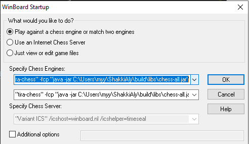

# ShakkiAly

Shakkitekoälyn toteutus Javalla. 

## Käyttöohje
.jar tiedoston kääntäminen seuraavalla komennolla.

    ./gradlew build

Tarvittavan tiedoston pitäisi löytyä kansiosta ./build/libs/chess-all.jar

Tätä tekoälyä voi käyttää mm. Winboard/Xboard sovelluksilla ja lichess-shakki serverillä.

Winboardilla esimerkiksi pääsee pelaamaan tekoälyn kanssa käyttämällä seuraavaa configuraatiota: 

    "tira-chess" -fcp "java -jar **HAKEMISTON_SIJAINTI**\ShakkiAly\build\libs\chess-all.jar"

xBoard ja Lichess ohjeet löytyvät englanniksi [projektipohjan dokumentaatiosta](./dokumentaatio/projektipohjan/Beginners_guide.md)

## Testikattavuus

[Jacoco-testiraportti](https://nooblue.github.io/ShakkiAly/)

## Dokumentaatio

* [Määrittelydokumentti](./dokumentaatio/maarittelydokumentti.md)

* [Testausdokumentti](./dokumentaatio/testausdokumentti.md)

* [Toteutusdokumentti](./dokumentaatio/toteutusdokumentti.md)

## Viikkoraportit

* [Viikko 1](./dokumentaatio/viikkoraportit/viikko1.md)

* [Viikko 2](./dokumentaatio/viikkoraportit/viikko2.md)

* [Viikko 3](./dokumentaatio/viikkoraportit/viikko3.md)

* [Viikko 4](./dokumentaatio/viikkoraportit/viikko4.md)

