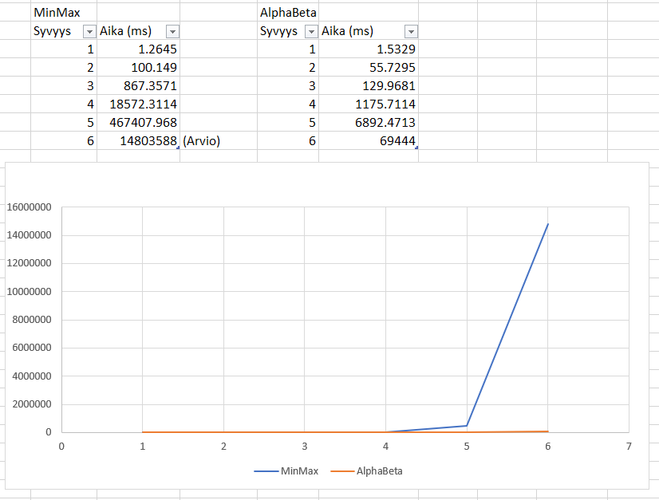

# Testausdokumentti

## Mitä on testattu

Eri nappuloiden mahdollisten siirtojen generointia on testattu useassa eri esimerkkitilanteessa. Testeissä on katsottu tavallisten sekä erikoissiirtojen (ei tornitusta eikä ohestalyöntiä) generointia, tähän sisältyy myös siirrot joilla syödään vastapelaajan nappuloita. On myös testattu ettei vahingossa generoida duplikaatteja siirtoja.

Pelilaudan luonnin oikeellisuus on testattu. Testit kattavat myös siirtojen prosessoinnin, joka takaa että tekoäly ei sekoa pelin aikana. 

Ruutujen ja siirtojen luonti sekä metodit on testattu yksinkertaisilla esimerkkisyötteillä.

SiirtoLista pohjautuu taulukkoon, jonka takia taulukon kasvattaminen tarvittaessa ja indeksin oikeellisuus on siinä testauksen keskipisteenä.

NegaMax algoritmin oikeellisuus on testattu katsomalla, että löytääkö se ShakkiMatin lyhimmältä syvyydeltä.  

Pelitilanteen evaluaattorin ja sen osien testaus on tehty esimerkkisyötteillä, joista pitäisi helposti nähdä kumpi puoli on johdossa. 


## Millaisilla syötteillä testaus tehtiin

Nappuloiden testeissä syötteinä on jokin pelilaudan tilanne ja siellä tarkasteltavana oleva nappula. Nappulan generoituja liikkeitä tarkastellaan ja katsotaan onko ne oikein.

Pelilaudan testauksessa syötteenä on laudan alkutilanne ja tarkasteltava siirto. Laudan uutta tilaa verrataan odotettuun tilaan. Pelilaudan siirtojen peruutuksen testauksessa katsotaan että pelilauta palautuu peruutuksen jälkeen takaisin alkuperäiseen tilaan. 


## Miten on testattu

Testit on tehty JUnit:illa yksikkötesteinä.  

## Tehokkuustestaus

Tällä hetkellä uuden liikkeen miettiminen kestää noin 0.04 millisekunttia per läpikäytävä siirto. 
MiniMaxin tehokkuutta voidaan arvioida siis kaavalla: 0.04 * 31 ^ syvyys, missä 31 on shakille arvioitu keskimääräinen haarautuvuusluku. [1]

Esim. syvyydellä 5 liikkeen haku kestäisi noin 16.2 minuuttia (16.2 = (0.04 * 30 ^ 5) / 1000 / 60).
Verrattuna pelin alussa olevaan haarautuvuuteen 20, hakuun kuluisi n. 2.1 minuuttia (2.1 = (0.04 * 20 ^ 5) / 1000 / 60))

Olen alustavasti ottanut kirjaa tekoälyn tehokkuudesta pelin alusta (jossa haarautuvuus on keskimääräistä huomattavasti pienempi).
Alpha-beta karsinta pienentää huomattavasti pelipuun läpikäyntiin menevää aikaa. 




```
Tarkastellaan ShakkiAlya, AlphaBeta käytössä: true, maksimisyvyydellä: 1
    Liikkeen haussa kesti: 36135400 nanosekunttia  / 36.1354 millisekunttia.
    Käytiin läpi yhteensä 20 nodea
    Yhden noden läpikäymiseen kului aikaa: 1.8067699999999998 millisekunttia
    Keskimääräinen haarautuvuus: 20.0 nodea

Tarkastellaan ShakkiAlya, AlphaBeta käytössä: false, maksimisyvyydellä: 1
    Liikkeen haussa kesti: 30110400 nanosekunttia  / 30.1104 millisekunttia.
    Käytiin läpi yhteensä 20 nodea
    Yhden noden läpikäymiseen kului aikaa: 1.50552 millisekunttia
    Keskimääräinen haarautuvuus: 20.0 nodea

Tarkastellaan ShakkiAlya, AlphaBeta käytössä: true, maksimisyvyydellä: 2
    Liikkeen haussa kesti: 43397800 nanosekunttia  / 43.3978 millisekunttia.
    Käytiin läpi yhteensä 165 nodea
    Yhden noden läpikäymiseen kului aikaa: 0.2630169696969697 millisekunttia
    Keskimääräinen haarautuvuus: 12.84523257866513 nodea

Tarkastellaan ShakkiAlya, AlphaBeta käytössä: false, maksimisyvyydellä: 2
    Liikkeen haussa kesti: 40453900 nanosekunttia  / 40.4539 millisekunttia.
    Käytiin läpi yhteensä 440 nodea
    Yhden noden läpikäymiseen kului aikaa: 0.09194068181818181 millisekunttia
    Keskimääräinen haarautuvuus: 20.97617696340303 nodea

Tarkastellaan ShakkiAlya, AlphaBeta käytössä: true, maksimisyvyydellä: 3
    Liikkeen haussa kesti: 141759800 nanosekunttia  / 141.7598 millisekunttia.
    Käytiin läpi yhteensä 1350 nodea
    Yhden noden läpikäymiseen kului aikaa: 0.10500725925925927 millisekunttia
    Keskimääräinen haarautuvuus: 11.052094495921159 nodea

Tarkastellaan ShakkiAlya, AlphaBeta käytössä: false, maksimisyvyydellä: 3
    Liikkeen haussa kesti: 393424200 nanosekunttia  / 393.4242 millisekunttia.
    Käytiin läpi yhteensä 9769 nodea
    Yhden noden läpikäymiseen kului aikaa: 0.04027271982802743 millisekunttia
    Keskimääräinen haarautuvuus: 21.377161415211884 nodea

Tarkastellaan ShakkiAlya, AlphaBeta käytössä: true, maksimisyvyydellä: 4
    Liikkeen haussa kesti: 621900000 nanosekunttia  / 621.9 millisekunttia.
    Käytiin läpi yhteensä 14916 nodea
    Yhden noden läpikäymiseen kului aikaa: 0.0416934835076428 millisekunttia
    Keskimääräinen haarautuvuus: 11.051293006982315 nodea

Tarkastellaan ShakkiAlya, AlphaBeta käytössä: false, maksimisyvyydellä: 4
    Liikkeen haussa kesti: 8495700300 nanosekunttia  / 8495.7003 millisekunttia.
    Käytiin läpi yhteensä 227582 nodea
    Yhden noden läpikäymiseen kului aikaa: 0.037330282271884424 millisekunttia
    Keskimääräinen haarautuvuus: 21.841601413831622 nodea

Tarkastellaan ShakkiAlya, AlphaBeta käytössä: true, maksimisyvyydellä: 5
    Liikkeen haussa kesti: 8124183900 nanosekunttia  / 8124.1839 millisekunttia.
    Käytiin läpi yhteensä 193374 nodea
    Yhden noden läpikäymiseen kului aikaa: 0.042012803686121196 millisekunttia
    Keskimääräinen haarautuvuus: 11.409841623893115 nodea

Tarkastellaan ShakkiAlya, AlphaBeta käytössä: false, maksimisyvyydellä: 5
    Liikkeen haussa kesti: 216667105000 nanosekunttia  / 216667.105 millisekunttia.
    Käytiin läpi yhteensä 5590434 nodea
    Yhden noden läpikäymiseen kului aikaa: 0.03875675931421425 millisekunttia
    Keskimääräinen haarautuvuus: 22.360891016007102 nodea
```


Lähteet: 

[1] https://chess.stackexchange.com/questions/23135/what-is-the-average-number-of-legal-moves-per-turn/24325#24325