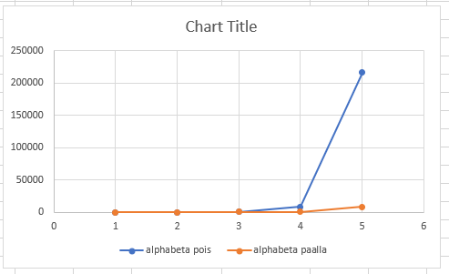

# Testausdokumentti

## Mitä on testattu

Eri nappuloiden mahdollisten siirtojen generointia on testattu useassa eri esimerkkitilanteessa. Testeissä on katsottu tavallisten sekä erikoissiirtojen (ei tornitusta eikä ohestalyöntiä) generointia, tähän sisältyy myös siirrot joilla syödään vastapelaajan nappuloita. On myös testattu ettei vahingossa generoida duplikaatteja siirtoja.

Pelilaudan luonnin oikeellisuus on testattu. Testit kattavat myös siirtojen prosessoinnin, joka takaa että tekoäly ei sekoa pelin aikana. 

Ruutujen ja siirtojen luonti sekä metodit on testattu.

SiirtoLista pohjautuu taulukkoon, jonka takia taulukon kasvattaminen tarvittaessa ja indeksin oikeellisuus on siinä testauksen keskipisteenä.


## Millaisilla syötteillä testaus tehtiin

Nappuloiden testeissä syötteinä on jokin pelilaudan tilanne ja siellä tarkasteltavana oleva nappula. Nappulan generoituja liikkeitä tarkastellaan ja katsotaan onko ne oikein.

Pelilaudan testauksessa syötteenä on laudan alkutilanne ja tarkasteltava siirto. Laudan uutta tilaa verrataan odotettuun tilaan.


## Miten on testattu

Testit on tehty JUnit:illa yksikkötesteinä.  

## Tehokkuustestaus

Vähän alustavaa tehokkuustestausta:

Tällä hetkellä uuden liikkeen miettiminen kestää noin 0.1 millisekunttia per läpikäytävä siirto. 
MiniMaxin tehokkuutta voidaan arvioida siis kaavalla: 0.1 * 31 ^ syvyys, missä 31 on shakille arvioitu keskimääräinen haarautuvuusluku. [1]

Esim. syvyydellä 5 liikkeen haku kestäisi noin 40.5 minuuttia (40.5 = (0.1 * 30^5) / 1000 / 60).
Verrattuna pelin alussa olevaan haarautuvuuteen 20, hakuun kuluisi n. 5.3 minuuttia (5.3 = (0.1 * 20^5) / 1000 / 60))

Olen alustavasti ottanut kirjaa tekoälyn tehokkuudesta pelin alusta (jossa haarautuvuus on keskimääräistä huomattavasti pienempi).
Pelin alussa luulisi tämänhetkisellä heuristiikalla AlphaBetan auttavan erityisen paljon, sillä jos ei päästä syömään vastustajan nappuloita, niin heuristiikka tulee näyttämään **suurimmalle osalle tilanteista identtistä laudan arvoa**. (Ja AlphaBeta karsii nämä haarat pois)




```
Tarkastellaan ShakkiAlya: AlphaBeta käytössä: false, maksimisyvyydellä: 1
    Liikkeen haussa kesti: 1264500 nanosekunttia  / 1.2645 millisekunttia.
    Käytiin läpi yhteensä 20 nodea
    Yhden noden läpikäymiseen kului aikaa: 0.063225 millisekunttia
    Keskimääräinen haarautuvuus: 20.0 nodea
Tarkastellaan ShakkiAlya: AlphaBeta käytössä: true, maksimisyvyydellä: 1
    Liikkeen haussa kesti: 1532900 nanosekunttia  / 1.5329 millisekunttia.
    Käytiin läpi yhteensä 20 nodea
    Yhden noden läpikäymiseen kului aikaa: 0.07664499999999999 millisekunttia
    Keskimääräinen haarautuvuus: 20.0 nodea

Tarkastellaan ShakkiAlya: AlphaBeta käytössä: false, maksimisyvyydellä: 2
    Liikkeen haussa kesti: 100149000 nanosekunttia  / 100.149 millisekunttia.
    Käytiin läpi yhteensä 440 nodea
    Yhden noden läpikäymiseen kului aikaa: 0.22761136363636364 millisekunttia
    Keskimääräinen haarautuvuus: 20.97617696340303 nodea
Tarkastellaan ShakkiAlya: AlphaBeta käytössä: true, maksimisyvyydellä: 2
    Liikkeen haussa kesti: 55729500 nanosekunttia  / 55.7295 millisekunttia.
    Käytiin läpi yhteensä 440 nodea
    Yhden noden läpikäymiseen kului aikaa: 0.12665795454545456 millisekunttia
    Keskimääräinen haarautuvuus: 20.97617696340303 nodea

Tarkastellaan ShakkiAlya: AlphaBeta käytössä: false, maksimisyvyydellä: 3
    Liikkeen haussa kesti: 867357100 nanosekunttia  / 867.3571 millisekunttia.
    Käytiin läpi yhteensä 9342 nodea
    Yhden noden läpikäymiseen kului aikaa: 0.09284490473132091 millisekunttia
    Keskimääräinen haarautuvuus: 21.06104685504863 nodea
Tarkastellaan ShakkiAlya: AlphaBeta käytössä: true, maksimisyvyydellä: 3
    Liikkeen haussa kesti: 129968100 nanosekunttia  / 129.9681 millisekunttia.
    Käytiin läpi yhteensä 1915 nodea
    Yhden noden läpikäymiseen kului aikaa: 0.06786845953002611 millisekunttia
    Keskimääräinen haarautuvuus: 12.418131643032611 nodea

Tarkastellaan ShakkiAlya: AlphaBeta käytössä: false, maksimisyvyydellä: 4
    Liikkeen haussa kesti: 18572311400 nanosekunttia  / 18572.3114 millisekunttia.
    Käytiin läpi yhteensä 206615 nodea
    Yhden noden läpikäymiseen kului aikaa: 0.08988849502698254 millisekunttia
    Keskimääräinen haarautuvuus: 21.32016011330756 nodea
Tarkastellaan ShakkiAlya: AlphaBeta käytössä: true, maksimisyvyydellä: 4
    Liikkeen haussa kesti: 1175711400 nanosekunttia  / 1175.7114 millisekunttia.
    Käytiin läpi yhteensä 16519 nodea
    Yhden noden läpikäymiseen kului aikaa: 0.07117327925419213 millisekunttia
    Keskimääräinen haarautuvuus: 11.336942352672944 nodea

Tarkastellaan ShakkiAlya: AlphaBeta käytössä: false, maksimisyvyydellä: 5
    Liikkeen haussa kesti: 467407967800 nanosekunttia  / 467407.9678 millisekunttia.
    Käytiin läpi yhteensä 5071619 nodea
    Yhden noden läpikäymiseen kului aikaa: 0.09216149079810608 millisekunttia
    Keskimääräinen haarautuvuus: 21.929530009312227 nodea
Tarkastellaan ShakkiAlya: AlphaBeta käytössä: true, maksimisyvyydellä: 5
    Liikkeen haussa kesti: 6892471300 nanosekunttia  / 6892.4713 millisekunttia.
    Käytiin läpi yhteensä 92136 nodea
    Yhden noden läpikäymiseen kului aikaa: 0.0748075811843362 millisekunttia
    Keskimääräinen haarautuvuus: 9.837525492204788 nodea


Ilman AlphaBetaa ja maksimisyvyydellä 6, kestäisi aivan liikaa aikaa, joten arvioin sen kuluttamaa aikaa ylempänä olevalla kaavakkeella:
0.1 * 23^6 = 14803588.9 millisekunttia

Tarkastellaan ShakkiAlya: AlphaBeta käytössä: true, maksimisyvyydellä: 6
    Liikkeen haussa kesti: 69444313100 nanosekunttia  / 69444.3131 millisekunttia.
    Käytiin läpi yhteensä 837671 nodea
    Yhden noden läpikäymiseen kului aikaa: 0.08290165602008426 millisekunttia
    Keskimääräinen haarautuvuus: 9.709098641701662 nodea


```


Lähteet: 

[1] https://chess.stackexchange.com/questions/23135/what-is-the-average-number-of-legal-moves-per-turn/24325#24325